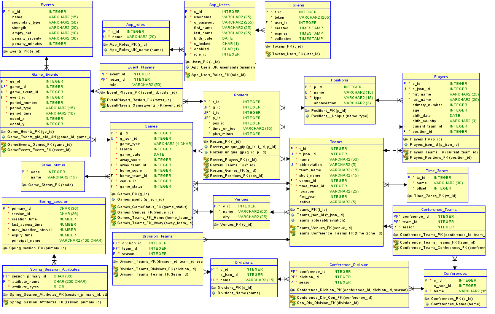

# NHLApp_v3

Spring MVC app displaying data loaded from api (https://api.nhle.com) using [NHLDataLoader2](https://github.com/Tomas-Mas/NHLDataLoader_v2/) stored in Oracle.
	 
Apart from some small tweaks biggest change from v2 is the use of Spring boot, Spring Security and Spring Session.

# Technologies
- Maven
- Spring Boot (3.3.2)
- Java 17
- Oracle 19c
- Spring Web MVC
- Spring Security
- Spring Session
- JPA/Hibernate
- JPA Criteria API
- Tomcat
- JSTL
- JSP, CSS, Javascript

# How to run
TODO

# General Description
After running app, non logged-in users are automatically logged-in as Guest users.  
Requests are served by Spring controllers.  
Data are retrieved from db using JPA criteria API.  
JSP page is then filled using Javascript and styled using CSS.  
Pages are broken down to components, each component then load its data by javascript. This allows for some fancy functionality and in future should make shift to React smoother.  

# Current progress
Only some basic infrastructure and couple of testing views for handling users (register, login).  
More to come in near future!

# Others
Sql scripts (schema, inserts, views) are in SQL_scripts folder
	   
DB model:

